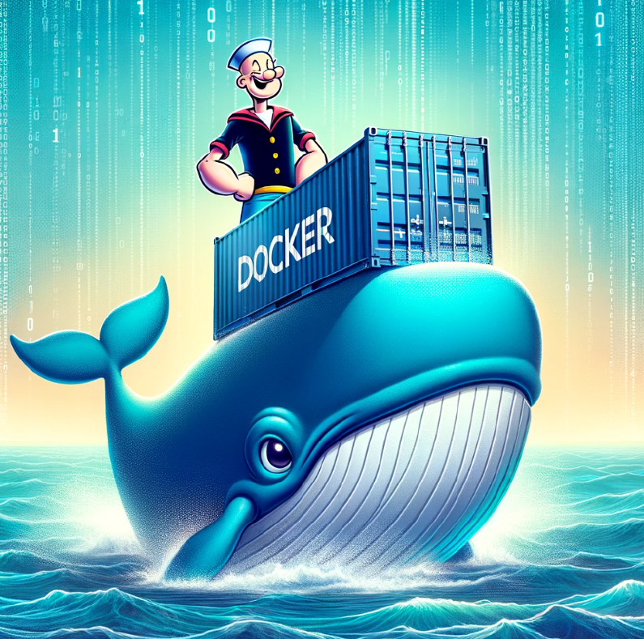
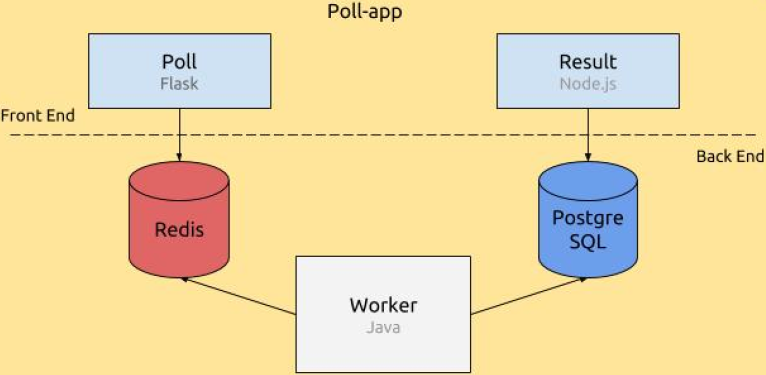

# 🐳 Popeye - Projet DevOps avec Docker 🐳

🐳 Popeye - Projet DevOps avec Docker 🐳
Bienvenue sur Popeye, un projet basé sur Docker et Docker Compose permettant de déployer une application complète de vote en utilisant Flask, Redis, Java et Node.js.

📖 Description du Projet
Popeye est une application Web où les utilisateurs peuvent voter et voir les résultats en temps réel. L'application est conteneurisée avec Docker et repose sur plusieurs microservices :                                                       

🐍 poll (Flask) : Application permettant aux utilisateurs de voter.                                
🐿️ redis : File d'attente pour stocker temporairement les votes.                                 
☕ worker (Java) : Traitement des votes et stockage en base de données PostgreSQL.                                      
🐘 db (PostgreSQL) : Stockage des votes.                                                
🚀 result (Node.js) : Interface affichant les résultats.                                                         

🛠️ Technologies utilisées                                               
Docker & Docker Compose                                                              
Python 3.9 + Flask                                                
Node.js 18                                                               
PostgreSQL                                                           
Redis
Java + Maven                                             

🚀 Installation et Exécution                              
1️⃣ Cloner le projet                                           
git clone https://github.com/Deniz09OK/Popeye.git                                        
cd Popeye                               

2️⃣ Installer Docker                                          
Docker est disponible pour Linux, macOS et Windows.                            
Téléchargez et installez Docker à partir du site officiel :                                
🔗 https://www.docker.com/products/docker-desktop/                                            

Vérifiez que Docker est bien installé :                                                 
docker --version                                       
docker-compose --version                                      

3️⃣ Démarrer les conteneurs                               
docker-compose up --build                                                      
Cela construit et démarre tous les services.                                   

4️⃣ Accéder aux services                             
Service	URL d'accès                               
Poll (Vote)	http://localhost:5000                             
Result (Résultats)	http://localhost:5001                                             

🔧 Commandes utiles                                                     
🔄 Redémarrer l'application                            
docker-compose down -v                         
docker-compose up --build                            

📜 Afficher les logs des conteneurs                        
docker logs <nom_du_conteneur>                                                            

Exemples :                                                                       
docker logs popeye-db-1                                             
docker logs popeye-worker-1                                   
docker logs popeye-poll-1                                    

🛑 Arrêter les conteneurs                                   
docker-compose down                          

📂 Structure du projet                                
Popeye/                                     
│── poll/              # Application Flask pour voter                                           
│── result/            # Application Node.js pour afficher les résultats                                 
│── worker/            # Application Java pour traiter les votes                                
│── db/                # Base de données PostgreSQL                               
│── docker-compose.yml # Configuration des services Docker                               
│── schema.sql         # Script SQL pour la base de données                         
│── README.md          # Documentation                                     

✅ Résultats attendus                              
Après avoir soumis des votes via poll, ils seront :                                      

Stockés dans Redis.                                       
Traitement par le worker.                             
Enregistrés dans la base de données PostgreSQL (db).                            
Affichés dynamiquement sur result.                              

